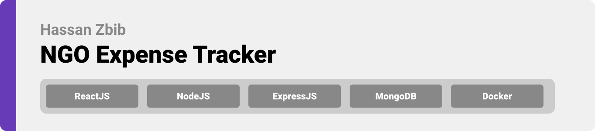
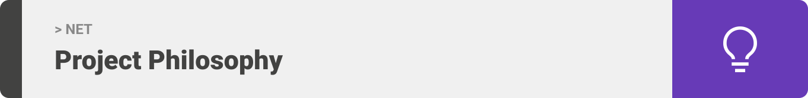
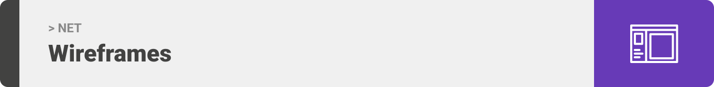
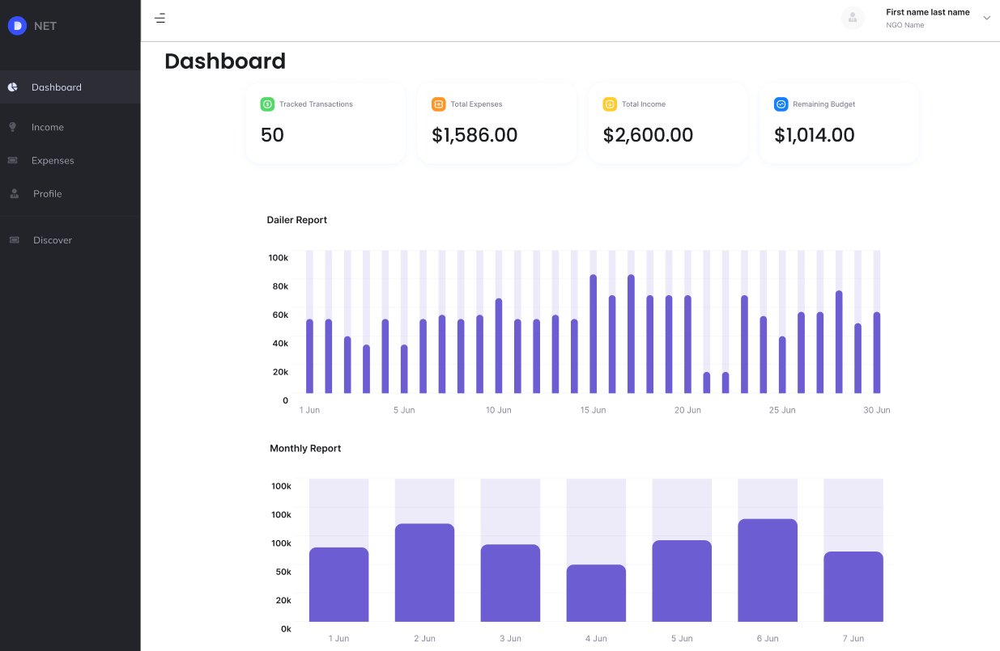
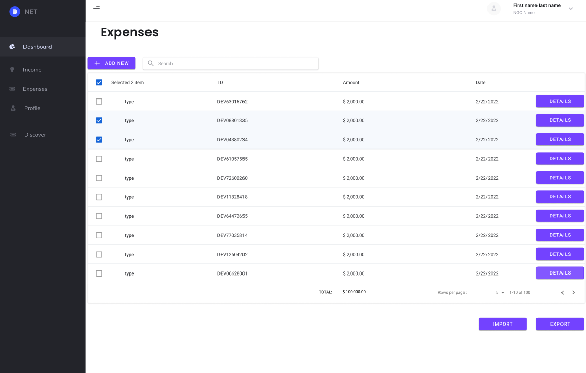
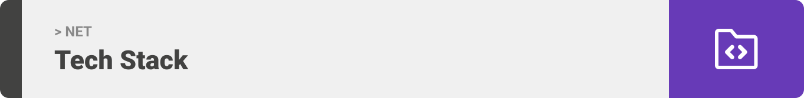
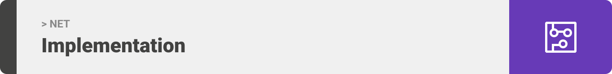
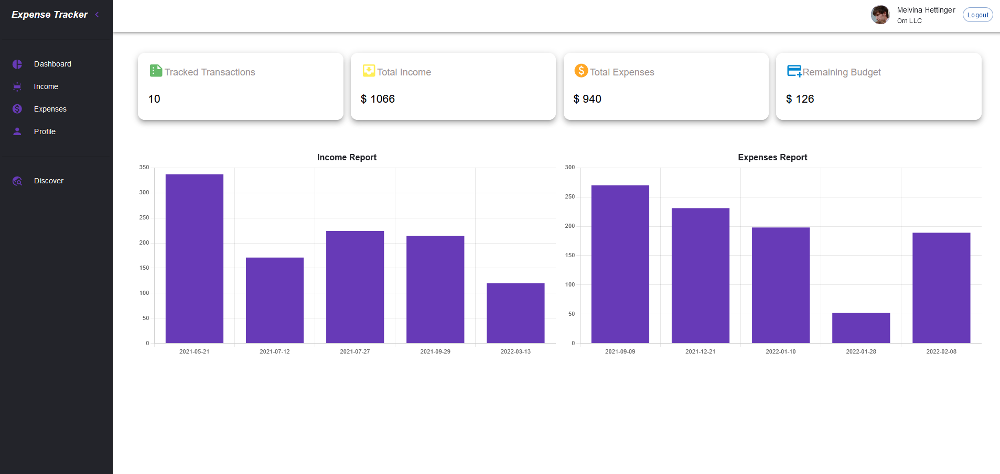
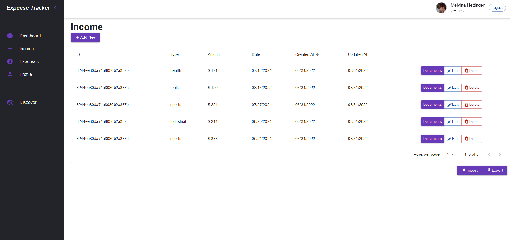
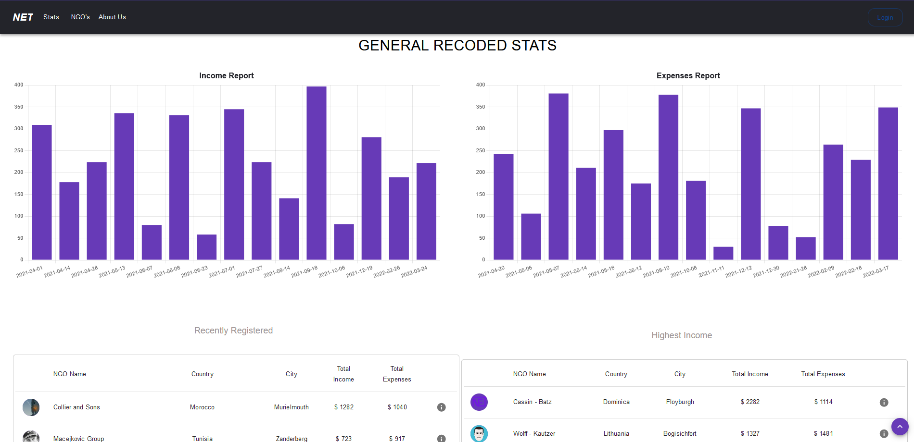

<div align="center">

> Hello world! This is the project’s summary that describes the project plain and simple, limited to the space available.

</div>

<br><br>



> NET is a website where users can track their income and expenses, save the relative documents, and access their overall statistics

### User Stories

- As a user, I want to import or export my data, so that I can store them elsewhere
- As a user, I want to browse my transactions, so that I can edit or add to them supporting documents
- As a user, I want to opt in or out from being publicly visible, so that my stats are kept private

<br><br>



> This design was planned before on paper, then moved to Figma app for the fine details.
> | User Dashboard | Expenses |
> | -----------------| -----|
> |   |  |

<br><br>



Here's a brief high-level overview of the tech stack NET uses:

- This project uses the React javascript library to power it's user interface, and the Express library to power it's API's 
- For persistent storage (database), the app uses mongoDB and the mongoose package which allows the app to create a custom storage schema and save it to a local database.
- This project was deployed using docker compose with seperate containers 
- The design of the app adheres to the material design guidelines.

<br><br>


> Uing the above mentioned tech stacks and the wireframes build with figma from the user stories we have, the implementation of the app is shown as below, these are screenshots from the real app
> | User Dashboard | Expenses |
> | -----------------| -----|
> |   |  |

> | Landing                                                                             
> | ---------------------------------------------------------------------------------------------- | 
> |  |

<br><br>


To get a local copy up and running follow these simple example steps.

### Prerequisites

This is a list of things you need to run the software and how to install them.

1. download and install NodeJS

2. update npm

```sh
npm install npm@latest -g
```

_To run the project with docker download Docker and Docker Compose, if you are running on windows it is recommended to install Docker Desktop_

### Installation 

1. Clone the repo
   ```sh
   git clone https://github.com/Hassan-Zbib/expense-tracker.git
   ```
2. Install NPM packages
   ```sh
   cd backend
   npm install
   cd ../frontend
   npm install
   ```
3. Enter your configurations in `./backend/.env.development` for example:
   ```env
   PORT = 5000
   MONGO_URI = mongodb://127.0.0.1:27017/expense-tracker-db
   ```
4. Run the backend
   ```sh
   npm run seed
   npm run dev
   ```
5. Run the frontend
   ```sh
   npm run start
   ```

### To Run with Docker
1. Enter your configurations in `./backend/.env.production` for example:
   ```env
   PORT = 5000
   MONGO_URI = mongodb://127.0.0.1:27017/expense-tracker-db

1. Change the react proxy in `frontend/package.json`
   ```json
     "proxy": "http://backend:5000/api",
   ```

2. Build and run the containers

   ```sh
   docker compose up
   ```
